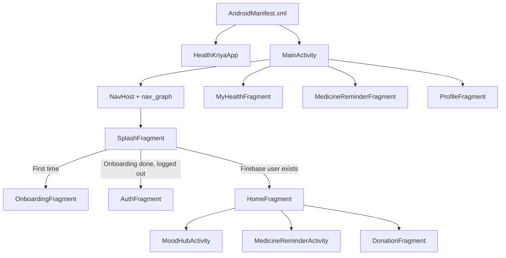
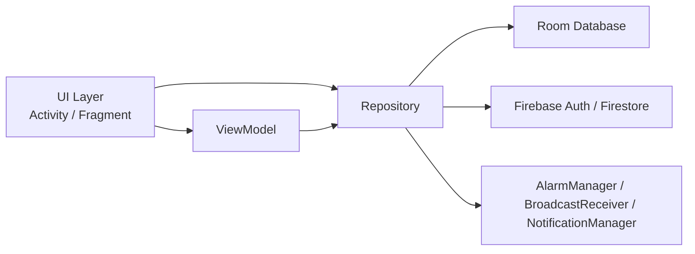
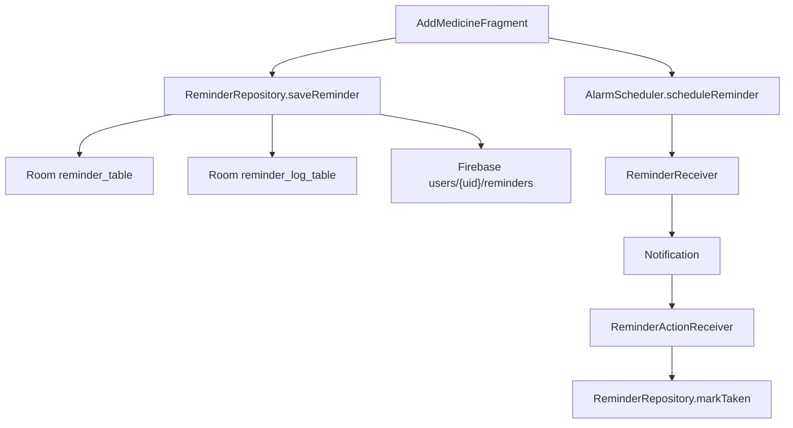

# HealthKriya App Workflow

This document explains the current app structure, major files, feature flows, data movement, and how modules are linked together.

## 1. Big Picture

HealthKriya currently follows this main pattern:

`Activity/Fragment -> ViewModel (where used) -> Repository -> Room DB / Firebase / Android system services`

There are 3 strong feature modules in the current app:

- Mood tracking
- Medicine reminders
- Donation/help flow

There are also supporting modules:

- Auth + onboarding
- Home dashboard
- Profile
- Health records / care activity

## 2. App Entry Flow

## 3. Startup Files

| File | Role | Main Link |
| --- | --- | --- |
| `app/src/main/AndroidManifest.xml` | App registration, permissions, activities, receivers | Launches `MainActivity`, registers reminder receivers |
| `app/src/main/java/com/kunal/healthkriya/core/HealthKriyaApp.java` | Global app init | Initializes Firebase, theme, sync restore |
| `app/src/main/java/com/kunal/healthkriya/MainActivity.java` | Main host activity | Holds bottom nav + `NavHostFragment` |
| `app/src/main/res/navigation/nav_graph.xml` | Navigation map | Defines fragment routes |
| `app/src/main/res/layout/activity_main.xml` | Main host layout | Contains nav host + bottom nav |

## 4. Main Navigation Logic

`MainActivity` hosts the bottom navigation and only keeps these 4 primary tabs visible:

- `homeFragment`
- `myHealthFragment`
- `remindersFragment`
- `profileFragment`

Other screens are pushed on top through navigation or opened as separate activities.

Separate activities are used for 2 feature areas:

- Mood flow: `MoodHubActivity`, `MoodContainerActivity`, `JournalDetailActivity`
- Reminder full-screen flow: `MedicineReminderActivity`

## 5. Shared Data Architecture

### Shared state files

| File | Role |
| --- | --- |
| `core/AppState.java` | In-memory current user state |
| `data/repository/AppRepository.java` | Shared auth, onboarding, cached/current user access |
| `data/source/FirebaseSource.java` | Firebase auth + Firestore user/profile operations |
| `data/source/LocalSource.java` | SharedPreferences for onboarding and cached basic user |
| `data/model/UserModel.java` | Main user model used by auth/profile |

## 6. Actual User Flow

### 6.1 Splash to Auth/Home

1. App opens `MainActivity`.
2. `nav_graph` starts from `SplashFragment`.
3. `SplashViewModel` asks `AppRepository`:
   - Firebase logged in?
   - Onboarding seen?
4. Based on that it navigates to:
   - `OnboardingFragment`
   - `AuthFragment`
   - `HomeFragment`

### 6.2 Auth flow

1. `AuthFragment` shows login or sign up mode.
2. `AuthViewModel` calls `AppRepository`.
3. `AppRepository` uses `FirebaseSource`.
4. On success:
   - user is saved locally via `LocalSource`
   - `AppState` is updated
   - current user live state is updated
5. App navigates to `HomeFragment`.

### 6.3 Global sync after login

`HealthKriyaApp` listens to Firebase auth state. When a user becomes available, it restores:

- donations
- moods
- reminders

This means sync can start even if login happens after app launch.

## 7. Module Map

### 7.1 Auth + Onboarding

### Files

| File | Purpose | Linked With |
| --- | --- | --- |
| `ui/splash/SplashFragment.java` | Splash animation + next destination | `SplashViewModel`, `nav_graph` |
| `ui/splash/SplashViewModel.java` | Decides onboarding/auth/home | `AppRepository` |
| `ui/onboarding/OnboardingFragment.java` | Intro screens | `OnboardingViewModel`, `OnboardingAdapter`, `AppRepository` |
| `ui/onboarding/OnboardingViewModel.java` | Onboarding page data | `OnboardingAdapter` |
| `ui/onboarding/OnboardingAdapter.java` | ViewPager onboarding items | `item_onboarding.xml` |
| `ui/auth/AuthFragment.java` | Login/signup UI | `AuthViewModel` |
| `ui/auth/AuthViewModel.java` | Auth state handling | `AppRepository` |
| `ui/auth/ForgotPasswordFragment.java` | Email + phone verification, reset mail | `AppRepository` |
| `data/repository/AppRepository.java` | Auth, onboarding, user cache | `FirebaseSource`, `LocalSource`, `AppState` |
| `data/source/FirebaseSource.java` | Firebase auth + Firestore users | `AppRepository` |
| `data/source/LocalSource.java` | SharedPreferences cache | `AppRepository` |

### Process

`Splash -> Onboarding -> Auth -> Home`

Important behavior:

- onboarding flag is stored in SharedPreferences
- login/signup is Firebase based
- current user live data is exposed to profile-related screens

### 7.2 Home

### Files

| File | Purpose | Linked With |
| --- | --- | --- |
| `ui/home/HomeFragment.java` | Main dashboard cards | `HomeViewModel`, opens mood/reminder/donation |
| `ui/home/HomeViewModel.java` | Home data access | `HomeRepository` |
| `data/repository/HomeRepository.java` | Supplies home summary data | `AppState` |
| `data/model/home/HomeDataModel.java` | Home combined data model | Home UI |
| `data/model/home/UserSummary.java` | Greeting/profile summary | Home UI |
| `data/model/home/MoodSummary.java` | Mood summary card data | Home UI |
| `data/model/home/MedicineSummary.java` | Medicine summary card data | Home UI |
| `data/model/home/EmergencySummary.java` | Emergency summary card data | Home UI |

### Current reality

The `HomeRepository` currently returns mostly placeholder summaries. The dashboard routing is real, but the summary values are not deeply wired yet.

### Card links

- Mood card -> `MoodHubActivity`
- Medicine card -> `MedicineReminderActivity`
- Donate card -> `DonationFragment`
- Emergency card -> toast only right now

### 7.3 Mood Module

### Files

| File | Purpose | Linked With |
| --- | --- | --- |
| `ui/mood/MoodHubActivity.java` | Mood landing page with date strip and preview | `MoodRepository`, `CalendarAdapter`, `MoodContainerActivity` |
| `ui/mood/MoodContainerActivity.java` | Hosts one selected mood screen | `EntryFragment`, `JournalFragment`, `AnalyticsFragment` |
| `ui/mood/entry/EntryFragment.java` | Save/update/delete mood entry | `MoodRepository` |
| `ui/mood/journal/JournalFragment.java` | List of all mood entries with filters | `MoodRepository`, `JournalAdapter` |
| `ui/mood/journal/JournalAdapter.java` | Mood journal recycler adapter | `item_journal.xml` |
| `ui/mood/journal/JournalDetailActivity.java` | Single mood entry detail | `MoodRepository` |
| `ui/mood/analytics/AnalyticsFragment.java` | Weekly/monthly charts | `MoodRepository`, MPAndroidChart |
| `ui/mood/analytics/MoodValueMarker.java` | Chart marker | Analytics charts |
| `ui/mood/calendar/CalendarAdapter.java` | Horizontal date selector | `MoodHubActivity` |
| `ui/mood/calendar/CalendarDateModel.java` | Calendar item data | `CalendarAdapter` |
| `ui/mood/MoodPagerAdapter.java` | Pager adapter for mood tabs | Present in codebase, not main current route |
| `data/repository/MoodRepository.java` | Core mood business logic | Room + Firebase sync |
| `data/source/FirebaseMoodSource.java` | Firestore mood sync helper | `MoodRepository` |
| `data/local/mood/MoodEntity.java` | Local mood table model | Room |
| `data/local/mood/MoodDao.java` | Mood queries | `MoodRepository` |
| `data/local/mood/MoodDatabase.java` | Room DB setup + migrations | `MoodRepository` |
| `data/model/MoodEntry.java` | Extra mood model | Secondary/legacy style model |

### Mood flow

1. Home opens `MoodHubActivity`.
2. User picks a date from horizontal date list.
3. `MoodHubActivity` loads existing mood preview for that date.
4. User opens one of:
   - Mood entry
   - Daily journal
   - Mood analytics
5. `EntryFragment` saves or deletes mood.
6. `MoodRepository` updates Room first.
7. Then it pushes data to Firebase.
8. Sync status becomes pending/synced/error.
9. Realtime listener can restore remote changes back into local DB.

### Mood data design

`MoodEntity` is keyed by `date`, so one date = one main mood entry.

### Important links

- `MoodHubActivity -> MoodContainerActivity`
- `EntryFragment -> MoodRepository`
- `JournalFragment -> JournalDetailActivity`
- `AnalyticsFragment -> MoodRepository.getAllMoods()`

### 7.4 Reminder Module

This is the most system-driven module because it combines:

- UI
- Room
- Firebase sync
- AlarmManager
- BroadcastReceivers
- notifications
- daily logs and adherence calculation

### Files

| File | Purpose | Linked With |
| --- | --- | --- |
| `ui/reminder/MedicineReminderActivity.java` | Full-screen reminder activity | Opens `MedicineReminderFragment.newInstance(true)` |
| `ui/reminder/MedicineReminderFragment.java` | Reminder list, summary, swipe delete | `ReminderRepository`, `MedicineAdapter`, `WeeklyCalendarAdapter` |
| `ui/reminder/AddMedicineFragment.java` | Add/edit reminder screen | `ReminderRepository`, `AlarmScheduler` |
| `ui/reminder/MedicineAdapter.java` | Reminder list adapter | `item_medicine.xml` |
| `ui/reminder/WeeklyCalendarAdapter.java` | Weekly adherence strip | `ReminderRepository.DailyOverview` |
| `ui/reminder/AlarmScheduler.java` | Exact alarm scheduling/cancel logic | `ReminderReceiver` |
| `ui/reminder/ReminderReceiver.java` | Alarm fired -> notification shown | `ReminderRepository` |
| `ui/reminder/ReminderActionReceiver.java` | "Taken" action from notification | `ReminderRepository.markTaken()` |
| `ui/reminder/BootCompletedReceiver.java` | Re-schedules alarms after reboot/update | `ReminderRepository.restoreAlarmsAfterBoot()` |
| `ui/reminder/ReminderStatusUtil.java` | Reminder status helper | `MedicineAdapter` |
| `data/repository/ReminderRepository.java` | Core reminder logic | Room + Firebase + broadcast + logs |
| `data/local/reminder/ReminderEntity.java` | Main reminder table model | Room |
| `data/local/reminder/ReminderDao.java` | Reminder queries | `ReminderRepository` |
| `data/local/reminder/ReminderLogEntity.java` | Daily reminder log table | `ReminderRepository` |
| `data/local/reminder/ReminderLogDao.java` | Reminder log queries | `ReminderRepository` |
| `data/local/reminder/ReminderDatabase.java` | Room DB + migration | `ReminderRepository` |
| `ui/reminder/model/MedicineModel.java` | Extra model class | Secondary/older helper model |

### Reminder process

1. User opens reminders from bottom nav or from Home.
2. User opens add/edit form.
3. `AddMedicineFragment` builds a `ReminderEntity`.
4. `AlarmScheduler` schedules the alarm.
5. `ReminderRepository.saveReminder()` stores reminder in Room.
6. Repository also creates/updates reminder log state.
7. Repository pushes reminder to Firebase.
8. When alarm fires, `ReminderReceiver` shows notification.
9. Notification action "Taken" goes to `ReminderActionReceiver`.
10. Repository marks it taken, updates logs, syncs state, and may disable one-time reminder.

### Reminder route difference

There are 2 reminder entry styles in the current app:

- Bottom nav route -> `MedicineReminderFragment` directly from nav graph
- Home card route -> `MedicineReminderActivity` hosting the fragment with add button + weekly strip enabled

### Reminder status chain

### 7.5 Donation Module

### Files

| File | Purpose | Linked With |
| --- | --- | --- |
| `ui/donation/DonationFragment.java` | Main donation landing screen with animated choices | Nav destinations |
| `ui/donation/DonationOptionFragment.java` | Alternate option chooser | Present but not the primary current entry path |
| `ui/donation/BloodDonateFragment.java` | Create blood donation availability | `DonationRepository` |
| `ui/donation/BloodRequestFragment.java` | Create blood request | `DonationRepository` |
| `ui/donation/MedicineDonateFragment.java` | Create medicine donation | `DonationRepository` |
| `ui/donation/MedicineRequestFragment.java` | Create medicine request | `DonationRepository` |
| `ui/donation/PublicHelpFeedFragment.java` | Public help feed list | `DonationRepository.fetchPublicRequests()` |
| `ui/donation/HelpFeedAdapter.java` | Public feed adapter | `PublicHelpFeedFragment` |
| `ui/donation/DonationRecentRenderer.java` | Renders recent entries section | Utility renderer |
| `data/repository/DonationRepository.java` | Core donation logic | Room + Firestore |
| `data/local/donation/DonationEntity.java` | Donation table model | Room |
| `data/local/donation/DonationDao.java` | Donation queries | `DonationRepository` |
| `data/local/donation/DonationDatabase.java` | Donation Room DB | `DonationRepository` |

### Donation process

1. Home opens `DonationFragment`.
2. User chooses blood or medicine.
3. User chooses donate or request.
4. Form fragment builds `DonationEntity`.
5. `DonationRepository.saveDonation()` saves it locally.
6. Repository pushes the same entry to Firestore.
7. Local sync state becomes pending/synced/error.
8. Profile `CareActivityFragment` later reads local active donation entries.

### Public help flow

`PublicHelpFeedFragment` reads public requests and uses `HelpFeedAdapter`.

### Important current note

There is a collection split in current code:

- normal save/restore uses `donations`
- public feed reads from `public_donations`

That means public feed and personal saved donations are not fully on the same pipeline right now.

### 7.6 Profile Module

### Files

| File | Purpose | Linked With |
| --- | --- | --- |
| `ui/profile/ProfileFragment.java` | Profile summary, settings rows, logout, theme switch | `ProfileViewModel`, nav graph |
| `ui/profile/ProfileViewModel.java` | Current user + logout | `AppRepository` |
| `ui/profile/ChangePasswordFragment.java` | Change current password | `AppRepository` |
| `ui/profile/HealthRecordsFragment.java` | Active medicines + medical conditions | `ProfileViewModel`, `ReminderRepository` |
| `ui/profile/CareActivityFragment.java` | Donation activity summary | `DonationRepository` |
| `ui/health/MyHealthFragment.java` | Health form screen placeholder | layout only currently |
| `ui/emergency/EmergencyFragment.java` | Emergency screen placeholder | layout only currently |

### Profile process

1. `ProfileFragment` observes current user live data.
2. User can navigate to:
   - Change password
   - My Health
   - Care Activity
   - Health Records
   - Emergency
3. Logout uses `AppRepository.logout()` and returns to auth.

### What is actually wired

- Name, email, phone display
- dark theme toggle
- change password
- health records from reminder data + medical conditions
- care activity from donation local data

### What is still light / placeholder

- `MyHealthFragment` has no logic yet
- `EmergencyFragment` has no logic yet

## 8. Database Layer

### Room databases

| DB | Files | Stores |
| --- | --- | --- |
| Mood DB | `MoodDatabase`, `MoodDao`, `MoodEntity` | one mood entry per date |
| Reminder DB | `ReminderDatabase`, `ReminderDao`, `ReminderEntity`, `ReminderLogDao`, `ReminderLogEntity` | reminders + day-wise status logs |
| Donation DB | `DonationDatabase`, `DonationDao`, `DonationEntity` | local donation/request entries |

### Firebase / Firestore usage

| Area | Service | Current collection/path |
| --- | --- | --- |
| Auth | Firebase Auth | email/password |
| User profile | Firestore | `users/{uid}` |
| Mood | Firestore | `users/{uid}/moods` |
| Reminder | Firestore | `users/{uid}/reminders` |
| Donation personal/main | Firestore | `donations` |
| Public help feed | Firestore | `public_donations` |
| Help interest | Firestore | `help_interests` |

## 9. Resource File Groups

### Layout files

These define the actual screens and card/item UIs:

- `activity_main.xml`
- `activity_medicine_reminder.xml`
- `activity_mood_hub.xml`
- `activity_mood_container.xml`
- `activity_journal_detail.xml`
- `fragment_splash.xml`
- `fragment_onboarding.xml`
- `fragment_auth.xml`
- `fragment_forgot_password.xml`
- `fragment_home.xml`
- `fragment_my_health.xml`
- `fragment_medicine_reminder.xml`
- `fragment_add_medicine.xml`
- `fragment_donation.xml`
- `fragment_donation_option.xml`
- `fragment_blood_donate.xml`
- `fragment_blood_request.xml`
- `fragment_medicine_donate.xml`
- `fragment_medicine_request.xml`
- `fragment_profile.xml`
- `fragment_change_password.xml`
- `fragment_health_records.xml`
- `fragment_care_activity.xml`
- `fragment_emergency.xml`
- `fragment_entry.xml`
- `fragment_journal.xml`
- `fragment_analytics.xml`
- `fragment_public_help_feed.xml`
- `card_home_mood.xml`
- `card_home_medicine.xml`
- `card_home_donate.xml`
- `card_home_emergency.xml`
- `item_medicine.xml`
- `item_journal.xml`
- `item_calendar_date.xml`
- `item_weekly_day.xml`
- `item_public_help.xml`
- `item_donation_recent_entry.xml`
- `item_onboarding.xml`
- `item_setting_row.xml`
- `item_home_card.xml`
- `view_chart_marker.xml`
- `item_mood_option_card.xml`

### Other resource groups

| Folder | Role |
| --- | --- |
| `res/navigation` | fragment routing |
| `res/menu` | bottom nav items |
| `res/drawable` | icons, backgrounds, shape drawables |
| `res/anim` and `res/animator` | card/nav/button motion |
| `res/values` | strings, colors, themes, styles |
| `res/color` | state selectors |
| `res/raw` | `emergency_siren.mp3` |

## 10. File-to-File Linking Summary

### Core chain

- `AndroidManifest.xml -> HealthKriyaApp`
- `AndroidManifest.xml -> MainActivity`
- `MainActivity -> nav_graph`
- `nav_graph -> SplashFragment / HomeFragment / ReminderFragment / ProfileFragment / Donation screens`

### Auth chain

- `AuthFragment -> AuthViewModel -> AppRepository -> FirebaseSource`
- `AppRepository -> LocalSource + AppState`

### Mood chain

- `HomeFragment -> MoodHubActivity`
- `MoodHubActivity -> MoodContainerActivity`
- `MoodContainerActivity -> EntryFragment / JournalFragment / AnalyticsFragment`
- `EntryFragment / JournalFragment / AnalyticsFragment -> MoodRepository`
- `MoodRepository -> MoodDao + MoodDatabase + FirebaseMoodSource`

### Reminder chain

- `HomeFragment -> MedicineReminderActivity`
- `MedicineReminderActivity -> MedicineReminderFragment`
- `MedicineReminderFragment -> AddMedicineFragment`
- `AddMedicineFragment -> AlarmScheduler + ReminderRepository`
- `ReminderReceiver -> ReminderRepository`
- `ReminderActionReceiver -> ReminderRepository`
- `BootCompletedReceiver -> ReminderRepository`
- `ReminderRepository -> ReminderDao + ReminderLogDao + Firebase`

### Donation chain

- `HomeFragment -> DonationFragment`
- `DonationFragment -> Blood/Medicine forms`
- `Form fragments -> DonationRepository`
- `DonationRepository -> DonationDao + Firestore`
- `CareActivityFragment -> DonationRepository`
- `PublicHelpFeedFragment -> DonationRepository`

### Profile chain

- `ProfileFragment -> ProfileViewModel -> AppRepository`
- `ChangePasswordFragment -> AppRepository`
- `HealthRecordsFragment -> ProfileViewModel + ReminderRepository`
- `CareActivityFragment -> DonationRepository`

## 11. Current Gaps / Cleanup Notes

These are important if you want to understand what is fully finished vs partially built:

- `HomeRepository` still returns mostly dummy summary data.
- `MyHealthFragment` is currently only a layout host.
- `EmergencyFragment` is currently only a layout host.
- `PublicHelpFeedFragment` is present but not part of the main bottom-nav flow.
- `DonationOptionFragment` exists but `DonationFragment` itself is the active primary chooser flow.
- `MoodPagerAdapter` exists but current main mood route uses `MoodContainerActivity` direct fragment loading.
- root-level `data/repository/DonationRepository.java` looks like an extra duplicate copy outside the main app source tree.
- `core/UserModel.java` looks like a legacy duplicate beside the actual `data/model/UserModel.java`.
- `LocalSource` currently stores only basic user info locally: `uid`, `email`, `profileCompleted`.

## 12. Source Tree Inventory

### Core files

- `app/src/main/java/com/kunal/healthkriya/MainActivity.java`
- `app/src/main/java/com/kunal/healthkriya/core/AppState.java`
- `app/src/main/java/com/kunal/healthkriya/core/HealthKriyaApp.java`
- `app/src/main/java/com/kunal/healthkriya/core/UserModel.java`
- `app/src/main/java/com/kunal/healthkriya/core/WindowInsetUtils.java`

### Data files

- `app/src/main/java/com/kunal/healthkriya/data/model/UserModel.java`
- `app/src/main/java/com/kunal/healthkriya/data/model/MoodEntry.java`
- `app/src/main/java/com/kunal/healthkriya/data/model/home/HomeDataModel.java`
- `app/src/main/java/com/kunal/healthkriya/data/model/home/UserSummary.java`
- `app/src/main/java/com/kunal/healthkriya/data/model/home/MoodSummary.java`
- `app/src/main/java/com/kunal/healthkriya/data/model/home/MedicineSummary.java`
- `app/src/main/java/com/kunal/healthkriya/data/model/home/EmergencySummary.java`
- `app/src/main/java/com/kunal/healthkriya/data/repository/AppRepository.java`
- `app/src/main/java/com/kunal/healthkriya/data/repository/HomeRepository.java`
- `app/src/main/java/com/kunal/healthkriya/data/repository/MoodRepository.java`
- `app/src/main/java/com/kunal/healthkriya/data/repository/ReminderRepository.java`
- `app/src/main/java/com/kunal/healthkriya/data/repository/DonationRepository.java`
- `app/src/main/java/com/kunal/healthkriya/data/source/FirebaseSource.java`
- `app/src/main/java/com/kunal/healthkriya/data/source/FirebaseMoodSource.java`
- `app/src/main/java/com/kunal/healthkriya/data/source/LocalSource.java`
- `app/src/main/java/com/kunal/healthkriya/data/local/mood/MoodEntity.java`
- `app/src/main/java/com/kunal/healthkriya/data/local/mood/MoodDao.java`
- `app/src/main/java/com/kunal/healthkriya/data/local/mood/MoodDatabase.java`
- `app/src/main/java/com/kunal/healthkriya/data/local/reminder/ReminderEntity.java`
- `app/src/main/java/com/kunal/healthkriya/data/local/reminder/ReminderDao.java`
- `app/src/main/java/com/kunal/healthkriya/data/local/reminder/ReminderDatabase.java`
- `app/src/main/java/com/kunal/healthkriya/data/local/reminder/ReminderLogEntity.java`
- `app/src/main/java/com/kunal/healthkriya/data/local/reminder/ReminderLogDao.java`
- `app/src/main/java/com/kunal/healthkriya/data/local/donation/DonationEntity.java`
- `app/src/main/java/com/kunal/healthkriya/data/local/donation/DonationDao.java`
- `app/src/main/java/com/kunal/healthkriya/data/local/donation/DonationDatabase.java`

### UI files

- `app/src/main/java/com/kunal/healthkriya/ui/splash/SplashFragment.java`
- `app/src/main/java/com/kunal/healthkriya/ui/splash/SplashViewModel.java`
- `app/src/main/java/com/kunal/healthkriya/ui/onboarding/OnboardingFragment.java`
- `app/src/main/java/com/kunal/healthkriya/ui/onboarding/OnboardingViewModel.java`
- `app/src/main/java/com/kunal/healthkriya/ui/onboarding/OnboardingAdapter.java`
- `app/src/main/java/com/kunal/healthkriya/ui/auth/AuthFragment.java`
- `app/src/main/java/com/kunal/healthkriya/ui/auth/AuthViewModel.java`
- `app/src/main/java/com/kunal/healthkriya/ui/auth/ForgotPasswordFragment.java`
- `app/src/main/java/com/kunal/healthkriya/ui/home/HomeFragment.java`
- `app/src/main/java/com/kunal/healthkriya/ui/home/HomeViewModel.java`
- `app/src/main/java/com/kunal/healthkriya/ui/health/MyHealthFragment.java`
- `app/src/main/java/com/kunal/healthkriya/ui/reminder/MedicineReminderActivity.java`
- `app/src/main/java/com/kunal/healthkriya/ui/reminder/MedicineReminderFragment.java`
- `app/src/main/java/com/kunal/healthkriya/ui/reminder/AddMedicineFragment.java`
- `app/src/main/java/com/kunal/healthkriya/ui/reminder/MedicineAdapter.java`
- `app/src/main/java/com/kunal/healthkriya/ui/reminder/WeeklyCalendarAdapter.java`
- `app/src/main/java/com/kunal/healthkriya/ui/reminder/AlarmScheduler.java`
- `app/src/main/java/com/kunal/healthkriya/ui/reminder/ReminderReceiver.java`
- `app/src/main/java/com/kunal/healthkriya/ui/reminder/ReminderActionReceiver.java`
- `app/src/main/java/com/kunal/healthkriya/ui/reminder/BootCompletedReceiver.java`
- `app/src/main/java/com/kunal/healthkriya/ui/reminder/ReminderStatusUtil.java`
- `app/src/main/java/com/kunal/healthkriya/ui/reminder/model/MedicineModel.java`
- `app/src/main/java/com/kunal/healthkriya/ui/donation/DonationFragment.java`
- `app/src/main/java/com/kunal/healthkriya/ui/donation/DonationOptionFragment.java`
- `app/src/main/java/com/kunal/healthkriya/ui/donation/BloodDonateFragment.java`
- `app/src/main/java/com/kunal/healthkriya/ui/donation/BloodRequestFragment.java`
- `app/src/main/java/com/kunal/healthkriya/ui/donation/MedicineDonateFragment.java`
- `app/src/main/java/com/kunal/healthkriya/ui/donation/MedicineRequestFragment.java`
- `app/src/main/java/com/kunal/healthkriya/ui/donation/PublicHelpFeedFragment.java`
- `app/src/main/java/com/kunal/healthkriya/ui/donation/HelpFeedAdapter.java`
- `app/src/main/java/com/kunal/healthkriya/ui/donation/DonationRecentRenderer.java`
- `app/src/main/java/com/kunal/healthkriya/ui/profile/ProfileFragment.java`
- `app/src/main/java/com/kunal/healthkriya/ui/profile/ProfileViewModel.java`
- `app/src/main/java/com/kunal/healthkriya/ui/profile/ChangePasswordFragment.java`
- `app/src/main/java/com/kunal/healthkriya/ui/profile/HealthRecordsFragment.java`
- `app/src/main/java/com/kunal/healthkriya/ui/profile/CareActivityFragment.java`
- `app/src/main/java/com/kunal/healthkriya/ui/emergency/EmergencyFragment.java`
- `app/src/main/java/com/kunal/healthkriya/ui/mood/MoodHubActivity.java`
- `app/src/main/java/com/kunal/healthkriya/ui/mood/MoodContainerActivity.java`
- `app/src/main/java/com/kunal/healthkriya/ui/mood/MoodPagerAdapter.java`
- `app/src/main/java/com/kunal/healthkriya/ui/mood/entry/EntryFragment.java`
- `app/src/main/java/com/kunal/healthkriya/ui/mood/journal/JournalFragment.java`
- `app/src/main/java/com/kunal/healthkriya/ui/mood/journal/JournalAdapter.java`
- `app/src/main/java/com/kunal/healthkriya/ui/mood/journal/JournalDetailActivity.java`
- `app/src/main/java/com/kunal/healthkriya/ui/mood/analytics/AnalyticsFragment.java`
- `app/src/main/java/com/kunal/healthkriya/ui/mood/analytics/MoodValueMarker.java`
- `app/src/main/java/com/kunal/healthkriya/ui/mood/calendar/CalendarAdapter.java`
- `app/src/main/java/com/kunal/healthkriya/ui/mood/calendar/CalendarDateModel.java`

## 13. Suggested Next Cleanup Order

If you want to improve the project step by step, this is the most practical order:

1. Wire real summary data into `HomeRepository`.
2. Finish `MyHealthFragment` and `EmergencyFragment`.
3. Unify donation collections so personal and public feed use one clear flow.
4. Remove or archive duplicate/legacy files.
5. Decide whether mood should keep `MoodContainerActivity` or move back to a proper pager flow.
